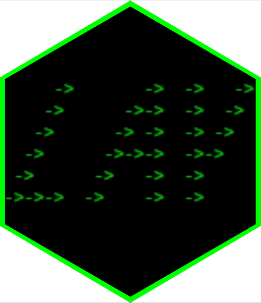

<!-- README.md is generated from README.Rmd. Please edit that file -->

```{r, include = FALSE}
knitr::opts_chunk$set(
  collapse = TRUE,
  comment = "#>",
  fig.path = "man/figures/",
  out.width = "70%",
  fig.align = "center"
)
```

#  **{lay}**

<!-- badges: start -->
[](https://CRAN.R-project.org/package=lay)
[](https://github.com/courtiol/lay/actions/workflows/R-CMD-check.yaml)
[](https://github.com/courtiol/lay/actions/workflows/test-coverage.yaml)
[](https://lifecycle.r-lib.org/articles/stages.html#experimental)
<!-- badges: end -->

## An R package for simple but efficient rowwise jobs

The function `lay()` -- the only function of the package **{lay}** -- is intended to be used to apply a function on each row of a data frame or tibble, independently, and across multiple columns containing values of the same class (e.g. all numeric).

Implementing rowwise operations for tabular data is notoriously awkward in R.
Many options have been proposed, but they tend to be complicated, inefficient, or both.
Instead `lay()` aims at reaching a sweet spot between simplicity and efficiency.

The function has been specifically designed to be combined with functions from [**{dplyr}**](https://dplyr.tidyverse.org/) and to feel as if 
it was part of it (but you can use `lay()` without [**{dplyr}**](https://dplyr.tidyverse.org/)).

There is hardly any code behind `lay()` (it can be coded in 3 lines), so this package may just be an interim solution before an established package fulfills the need... Time will tell.

### Installation


You can install the current CRAN version of **{lay}** with:

``` r
install.packages("lay")
```

Alternatively, you can install the development version of **{lay}** using [**{remotes}**](https://remotes.r-lib.org/):

``` r
remotes::install_github("courtiol/lay") ## requires to have installed {remotes}
```

### Motivation

Consider the following dataset, which contains information about the use of pain relievers for non medical purpose.
```{r motivation}
library(lay)  ## requires to have installed {lay}
drugs
```

The dataset is [tidy](https://vita.had.co.nz/papers/tidy-data.pdf): each row represents one individual and each variable forms a column.

Imagine now that you would like to know if each individual did use any of these pain relievers.

How would you proceed?


### Our solution: `lay()`

This is how you would achieve our goal using `lay()`:
```{r lay}
library(dplyr, warn.conflicts = FALSE)  ## requires to have installed {dplyr}

drugs_full |>
  mutate(everused = lay(pick(-caseid), any))
```

We used `mutate()` from [**{dplyr}**](https://dplyr.tidyverse.org/) to create a new column called *everused*, and we used `pick()` from that same package to remove the column *caseid* when laying down each row of the data and applying the function `any()`.

When combining `lay()` and [**{dplyr}**](https://dplyr.tidyverse.org/), you should always use `pick()` or `across()`. The functions `pick()` and `across()` let you pick among many [selection helpers](https://tidyselect.r-lib.org/reference/language.html) from the package [**{tidyselect}**](https://tidyselect.r-lib.org/), which makes it easy to specify which columns to consider.

Our function `lay()` is quite flexible! For example, you can pass argument(s) of the function you wish to apply rowwise (here `any()`):

```{r NA}
drugs_with_NA <- drugs     ## create a copy of the dataset
drugs_with_NA[1, 2] <- NA  ## introduce a missing value

drugs_with_NA |>
  mutate(everused = lay(pick(-caseid), any)) |> ## without additional argument
  slice(1)  ## keep first row only
  
drugs_with_NA |>
  mutate(everused = lay(pick(-caseid), any, na.rm = TRUE)) |>  ## with additional argument
  slice(1)
```

Since one of the backbones of `lay()` is  [**{rlang}**](https://rlang.r-lib.org), you can use the so-called [*lambda* syntax](https://rlang.r-lib.org/reference/as_function.html) to define anonymous functions on the fly:

```{r lambda}
drugs_with_NA |>
 mutate(everused = lay(pick(-caseid), ~ any(.x, na.rm = TRUE))) ## same as above, different syntax
```

We can also apply many functions at once, as exemplified with another dataset:

```{r worldbank}
data("world_bank_pop", package = "tidyr")  ## requires to have installed {tidyr}

world_bank_pop |>
  filter(indicator == "SP.POP.TOTL") |>
  mutate(lay(pick(matches("\\d")),
             ~ tibble(min = min(.x), mean = mean(.x), max = max(.x))), .after = indicator)
```

Since the other backbone of `lay()` is [**{vctrs}**](https://vctrs.r-lib.org), the splicing happens automatically (unless the output of the call is used to create a named column). This is why, in the last chunk of code, three different columns (*min*, *mean* and *max*) are directly created.

**Important:** when using `lay()` the function you want to use for the rowwise job must output a scalar (vector of length 1), or a tibble or data frame with a single row.

We can apply a function that returns a vector of length > 1 by turning such a vector into a tibble using `as_tibble_row()` from [**{tibble}**](https://tibble.tidyverse.org/):

```{r worldbank2}
world_bank_pop |>
  filter(indicator == "SP.POP.TOTL") |>
  mutate(lay(pick(matches("\\d")),
             ~ as_tibble_row(quantile(.x, na.rm = TRUE))), .after = indicator)
```

### History


The first draft of this package has been created by **@romainfrancois** as a reply to a tweet I (Alexandre Courtiol) posted under **@rdataberlin** in February 2020.
At the time I was exploring different ways to perform rowwise jobs in R and I was experimenting with various ideas on how to exploit the fact that the newly introduced function `across()` from [**{dplyr}**](https://dplyr.tidyverse.org/) creates tibbles on which one can easily apply a function.
Romain came up with `lay()` as the better solution, making good use of [**{rlang}**](https://rlang.r-lib.org/) & [**{vctrs}**](https://vctrs.r-lib.org/).

The verb `lay()` never made it to be integrated within [**{dplyr}**](https://dplyr.tidyverse.org/), but, so far, I still find `lay()` superior than most alternatives, which is why I decided to document and maintain this package.
