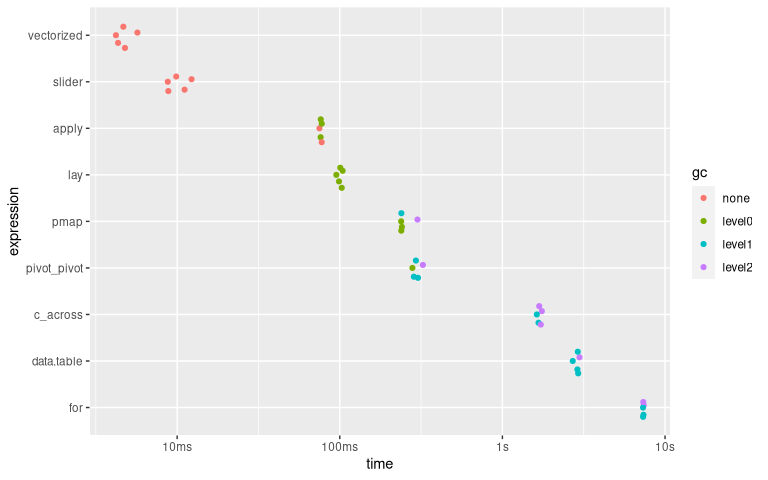

<!-- README.md is generated from README.Rmd. Please edit that file -->

# **{lay}** – an R package for simple but efficient rowwise jobs

<!-- badges: start -->

[](https://www.tidyverse.org/lifecycle/#experimental)
[](https://CRAN.R-project.org/package=lay)
[](https://github.com/courtiol/lay)
<!-- badges: end -->

## Why **{lay}**?

Doing rowwise operation is notoriously awkward in R.

Many options have been proposed, but they tend to be complicated,
inefficient, or both.

Instead **lay()** – the only function of the package **{lay}** – aims at
reaching a sweet spot between simplicity and efficiency.

The function has been specifically designed to be combined with
functions from [**{dplyr}**](https://dplyr.tidyverse.org/) and to feel
as if it was part of it (but you can use **lay()** without **{dplyr}**).

## Installation

You can install a development version of **{lay}** with:

``` r
# install.packages("remotes")
remotes::install_github("courtiol/lay")
```

## Motivation

Consider the following dataset, which contains information about the use
of pain relievers for non medical purpose.

``` r
library(lay)  ## requires to have installed {lay}
drugs
#> # A tibble: 100 x 8
#>    caseid hydrocd oxycodp codeine tramadl morphin methdon vicolor
#>    <chr>    <int>   <int>   <int>   <int>   <int>   <int>   <int>
#>  1 1            0       0       0       0       0       0       0
#>  2 2            0       0       0       0       0       0       0
#>  3 3            0       0       0       0       0       0       0
#>  4 4            0       0       0       0       0       0       0
#>  5 5            0       0       0       0       0       0       0
#>  6 6            0       0       0       0       0       0       0
#>  7 7            0       0       0       0       0       0       0
#>  8 8            0       0       0       0       0       0       0
#>  9 9            0       0       0       0       0       0       1
#> 10 10           0       0       0       0       0       0       0
#> # … with 90 more rows
```

The dataset is [tidy](https://vita.had.co.nz/papers/tidy-data.pdf): each
row represents one individual and each variable forms a column.

Imagine now that you would like to know if each individual did use any
of these pain relievers.

How would you proceed?

## Our solution: **lay()**

This is how you would achieve our goal using **lay()**:

``` r
library(dplyr, warn.conflicts = FALSE)  ## requires to have installed {dplyr}

drugs_full %>%
  mutate(everused = lay(across(-caseid), any))
#> # A tibble: 55,271 x 9
#>    caseid hydrocd oxycodp codeine tramadl morphin methdon vicolor everused
#>    <chr>    <int>   <int>   <int>   <int>   <int>   <int>   <int> <lgl>   
#>  1 1            0       0       0       0       0       0       0 FALSE   
#>  2 2            0       0       0       0       0       0       0 FALSE   
#>  3 3            0       0       0       0       0       0       0 FALSE   
#>  4 4            0       0       0       0       0       0       0 FALSE   
#>  5 5            0       0       0       0       0       0       0 FALSE   
#>  6 6            0       0       0       0       0       0       0 FALSE   
#>  7 7            0       0       0       0       0       0       0 FALSE   
#>  8 8            0       0       0       0       0       0       0 FALSE   
#>  9 9            0       0       0       0       0       0       1 TRUE    
#> 10 10           0       0       0       0       0       0       0 FALSE   
#> # … with 55,261 more rows
```

We used **mutate()** from **{dplyr}** to create a new column called
*everused*, and we use **across()** from that same package to remove the
column *caseid* when laying down each row of the data and applying the
function **any()**.

When combining **lay()** and **{dplyr}**, you should always use
**across()**. The function **across()** lets you pick among many
[selection
helpers](https://tidyselect.r-lib.org/reference/language.html) from the
package **{tidyselect}**, which makes it easy to specify which columns
to consider.

Our function **lay()** is quite flexible! For example, you can pass
argument(s) of the function you wish to apply rowwise (here **any()**):

``` r
drugs_with_NA <- drugs     ## create a copy of the dataset
drugs_with_NA[1, 2] <- NA  ## introduce a missing value

drugs_with_NA %>%
  mutate(everused = lay(across(-caseid), any)) %>% ## without additional argument
  slice(1)  ## keep first row only
#> # A tibble: 1 x 9
#>   caseid hydrocd oxycodp codeine tramadl morphin methdon vicolor everused
#>   <chr>    <int>   <int>   <int>   <int>   <int>   <int>   <int> <lgl>   
#> 1 1           NA       0       0       0       0       0       0 NA
  
drugs_with_NA %>%
  mutate(everused = lay(across(-caseid), any, na.rm = TRUE)) %>%  ## with additional argument
  slice(1)
#> # A tibble: 1 x 9
#>   caseid hydrocd oxycodp codeine tramadl morphin methdon vicolor everused
#>   <chr>    <int>   <int>   <int>   <int>   <int>   <int>   <int> <lgl>   
#> 1 1           NA       0       0       0       0       0       0 FALSE
```

Since one of the backbones of **lay()** is
[**{rlang}**](https://rlang.r-lib.org), you can use the so-called
[*lambda* syntax](https://rlang.r-lib.org/reference/as_function.html) to
define anonymous functions on the fly:

``` r
drugs_with_NA %>%
 mutate(everused = lay(across(-caseid), ~ any(.x, na.rm = TRUE))) ## same as above, different syntax
#> # A tibble: 100 x 9
#>    caseid hydrocd oxycodp codeine tramadl morphin methdon vicolor everused
#>    <chr>    <int>   <int>   <int>   <int>   <int>   <int>   <int> <lgl>   
#>  1 1           NA       0       0       0       0       0       0 FALSE   
#>  2 2            0       0       0       0       0       0       0 FALSE   
#>  3 3            0       0       0       0       0       0       0 FALSE   
#>  4 4            0       0       0       0       0       0       0 FALSE   
#>  5 5            0       0       0       0       0       0       0 FALSE   
#>  6 6            0       0       0       0       0       0       0 FALSE   
#>  7 7            0       0       0       0       0       0       0 FALSE   
#>  8 8            0       0       0       0       0       0       0 FALSE   
#>  9 9            0       0       0       0       0       0       1 TRUE    
#> 10 10           0       0       0       0       0       0       0 FALSE   
#> # … with 90 more rows
```

We can also apply many functions at once, as exemplified with another
dataset:

``` r
data("world_bank_pop", package = "tidyr")  ## requires to have installed {tidyr}

world_bank_pop %>%
  filter(indicator == "SP.POP.TOTL") %>%
  mutate(lay(across(matches("\\d")),
             ~ tibble(min = min(.x), mean = mean(.x), max = max(.x))), .after = indicator)
#> # A tibble: 264 x 23
#>    country indicator    min   mean    max `2000` `2001` `2002` `2003` `2004`
#>    <chr>   <chr>      <dbl>  <dbl>  <dbl>  <dbl>  <dbl>  <dbl>  <dbl>  <dbl>
#>  1 ABW     SP.POP.T… 9.09e4 1.00e5 1.05e5 9.09e4 9.29e4 9.50e4 9.70e4 9.87e4
#>  2 AFG     SP.POP.T… 2.01e7 2.78e7 3.55e7 2.01e7 2.10e7 2.20e7 2.31e7 2.41e7
#>  3 AGO     SP.POP.T… 1.64e7 2.25e7 2.98e7 1.64e7 1.70e7 1.76e7 1.82e7 1.89e7
#>  4 ALB     SP.POP.T… 2.87e6 2.96e6 3.09e6 3.09e6 3.06e6 3.05e6 3.04e6 3.03e6
#>  5 AND     SP.POP.T… 6.54e4 7.81e4 8.45e4 6.54e4 6.73e4 7.00e4 7.32e4 7.62e4
#>  6 ARB     SP.POP.T… 2.84e8 3.46e8 4.14e8 2.84e8 2.90e8 2.96e8 3.02e8 3.09e8
#>  7 ARE     SP.POP.T… 3.15e6 6.67e6 9.40e6 3.15e6 3.33e6 3.51e6 3.74e6 4.09e6
#>  8 ARG     SP.POP.T… 3.71e7 4.06e7 4.43e7 3.71e7 3.75e7 3.79e7 3.83e7 3.87e7
#>  9 ARM     SP.POP.T… 2.88e6 2.95e6 3.07e6 3.07e6 3.05e6 3.03e6 3.02e6 3.00e6
#> 10 ASM     SP.POP.T… 5.52e4 5.70e4 5.93e4 5.75e4 5.82e4 5.87e4 5.91e4 5.93e4
#> # … with 254 more rows, and 13 more variables: `2005` <dbl>, `2006` <dbl>,
#> #   `2007` <dbl>, `2008` <dbl>, `2009` <dbl>, `2010` <dbl>, `2011` <dbl>,
#> #   `2012` <dbl>, `2013` <dbl>, `2014` <dbl>, `2015` <dbl>, `2016` <dbl>,
#> #   `2017` <dbl>
```

Since the other backbone of **lay()** is
[**{vctrs}**](https://vctrs.r-lib.org), the splicing happens
automatically (unless the output of the call is used to create a named
column). This is why, in the last chunk of code, three different columns
(*min*, *mean* and *max*) where directly created.

**Important:** when using **lay()** the function you want to use for the
rowwise job must output a scalar (vector of length 1), or a tibble or
data frame with a single row.

We can apply a function that returns a vector of length &gt; 1 by
turning such vector into a tibble using **as\_tibble\_row()** from
[**{tibble}**](https://tibble.tidyverse.org/):

``` r
world_bank_pop %>%
  filter(indicator == "SP.POP.TOTL") %>%
  mutate(lay(across(matches("\\d")),
             ~ as_tibble_row(quantile(.x, na.rm = TRUE))), .after = indicator)
#> # A tibble: 264 x 25
#>    country indicator   `0%`  `25%`  `50%`  `75%` `100%` `2000` `2001` `2002`
#>    <chr>   <chr>      <dbl>  <dbl>  <dbl>  <dbl>  <dbl>  <dbl>  <dbl>  <dbl>
#>  1 ABW     SP.POP.T… 9.09e4 9.91e4 1.01e5 1.03e5 1.05e5 9.09e4 9.29e4 9.50e4
#>  2 AFG     SP.POP.T… 2.01e7 2.44e7 2.76e7 3.15e7 3.55e7 2.01e7 2.10e7 2.20e7
#>  3 AGO     SP.POP.T… 1.64e7 1.90e7 2.22e7 2.58e7 2.98e7 1.64e7 1.70e7 1.76e7
#>  4 ALB     SP.POP.T… 2.87e6 2.90e6 2.94e6 3.02e6 3.09e6 3.09e6 3.06e6 3.05e6
#>  5 AND     SP.POP.T… 6.54e4 7.64e4 7.90e4 8.26e4 8.45e4 6.54e4 6.73e4 7.00e4
#>  6 ARB     SP.POP.T… 2.84e8 3.11e8 3.44e8 3.80e8 4.14e8 2.84e8 2.90e8 2.96e8
#>  7 ARE     SP.POP.T… 3.15e6 4.21e6 7.28e6 8.98e6 9.40e6 3.15e6 3.33e6 3.51e6
#>  8 ARG     SP.POP.T… 3.71e7 3.88e7 4.06e7 4.24e7 4.43e7 3.71e7 3.75e7 3.79e7
#>  9 ARM     SP.POP.T… 2.88e6 2.90e6 2.93e6 3.00e6 3.07e6 3.07e6 3.05e6 3.03e6
#> 10 ASM     SP.POP.T… 5.52e4 5.56e4 5.66e4 5.85e4 5.93e4 5.75e4 5.82e4 5.87e4
#> # … with 254 more rows, and 15 more variables: `2003` <dbl>, `2004` <dbl>,
#> #   `2005` <dbl>, `2006` <dbl>, `2007` <dbl>, `2008` <dbl>, `2009` <dbl>,
#> #   `2010` <dbl>, `2011` <dbl>, `2012` <dbl>, `2013` <dbl>, `2014` <dbl>,
#> #   `2015` <dbl>, `2016` <dbl>, `2017` <dbl>
```

## Alternatives to **lay()**

Of course, there are many alternatives to perform rowwise jobs.

Let’s now consider, in turns, these alternatives – sticking to our
example about drugs usage.

### Alternative 1: vectorized solution

One solution is to simply do the following:

``` r
drugs_full %>%
  mutate(everused = codeine | hydrocd | methdon | morphin | oxycodp | tramadl | vicolor)
#> # A tibble: 55,271 x 9
#>    caseid hydrocd oxycodp codeine tramadl morphin methdon vicolor everused
#>    <chr>    <int>   <int>   <int>   <int>   <int>   <int>   <int> <lgl>   
#>  1 1            0       0       0       0       0       0       0 FALSE   
#>  2 2            0       0       0       0       0       0       0 FALSE   
#>  3 3            0       0       0       0       0       0       0 FALSE   
#>  4 4            0       0       0       0       0       0       0 FALSE   
#>  5 5            0       0       0       0       0       0       0 FALSE   
#>  6 6            0       0       0       0       0       0       0 FALSE   
#>  7 7            0       0       0       0       0       0       0 FALSE   
#>  8 8            0       0       0       0       0       0       0 FALSE   
#>  9 9            0       0       0       0       0       0       1 TRUE    
#> 10 10           0       0       0       0       0       0       0 FALSE   
#> # … with 55,261 more rows
```

It is certainly very efficient from a computational point of view, but
coding this way presents two main limitations:

-   you need to name all columns explicitly, which can be problematic
    when dealing with many columns
-   you are stuck with expressing your task with logical and arithmetic
    operators, which is not always sufficient

### Alternative 2: 100% **{dplyr}**

``` r
drugs%>%
  rowwise() %>%
  mutate(everused = any(c_across(-caseid))) %>%
  ungroup()
#> # A tibble: 100 x 9
#>    caseid hydrocd oxycodp codeine tramadl morphin methdon vicolor everused
#>    <chr>    <int>   <int>   <int>   <int>   <int>   <int>   <int> <lgl>   
#>  1 1            0       0       0       0       0       0       0 FALSE   
#>  2 2            0       0       0       0       0       0       0 FALSE   
#>  3 3            0       0       0       0       0       0       0 FALSE   
#>  4 4            0       0       0       0       0       0       0 FALSE   
#>  5 5            0       0       0       0       0       0       0 FALSE   
#>  6 6            0       0       0       0       0       0       0 FALSE   
#>  7 7            0       0       0       0       0       0       0 FALSE   
#>  8 8            0       0       0       0       0       0       0 FALSE   
#>  9 9            0       0       0       0       0       0       1 TRUE    
#> 10 10           0       0       0       0       0       0       0 FALSE   
#> # … with 90 more rows
```

It is easy to use as **c\_across()** turns its input into a vector and
**rowwise()** implies that the vector only represents one row at a time.
Yet, for now it remains quite slow on large datasets (see **Efficiency**
below).

### Alternative 3: **{tidyr}**

``` r
library(tidyr)  ## requires to have installed {tidyr}

drugs %>%
  pivot_longer(-caseid) %>%
  group_by(caseid) %>%
  mutate(everused = any(value)) %>%
  ungroup() %>%
  pivot_wider() %>%
  relocate(everused, .after = last_col())
#> # A tibble: 100 x 9
#>    caseid hydrocd oxycodp codeine tramadl morphin methdon vicolor everused
#>    <chr>    <int>   <int>   <int>   <int>   <int>   <int>   <int> <lgl>   
#>  1 1            0       0       0       0       0       0       0 FALSE   
#>  2 2            0       0       0       0       0       0       0 FALSE   
#>  3 3            0       0       0       0       0       0       0 FALSE   
#>  4 4            0       0       0       0       0       0       0 FALSE   
#>  5 5            0       0       0       0       0       0       0 FALSE   
#>  6 6            0       0       0       0       0       0       0 FALSE   
#>  7 7            0       0       0       0       0       0       0 FALSE   
#>  8 8            0       0       0       0       0       0       0 FALSE   
#>  9 9            0       0       0       0       0       0       1 TRUE    
#> 10 10           0       0       0       0       0       0       0 FALSE   
#> # … with 90 more rows
```

Here the trick is to turn the rowwise problem into a column problem by
pivoting the values and then pivoting the results back. Many find that
this involves a little too much intellectual gymnastic. It is also not
particularly efficient on large dataset both in terms of computation
time and memory required to pivot the tables.

### Alternative 4: **{purrr}**

``` r
library(purrr)  ## requires to have installed {purrr}

drugs %>%
  mutate(everused = pmap_lgl(across(-caseid), ~ any(...)))
#> # A tibble: 100 x 9
#>    caseid hydrocd oxycodp codeine tramadl morphin methdon vicolor everused
#>    <chr>    <int>   <int>   <int>   <int>   <int>   <int>   <int> <lgl>   
#>  1 1            0       0       0       0       0       0       0 FALSE   
#>  2 2            0       0       0       0       0       0       0 FALSE   
#>  3 3            0       0       0       0       0       0       0 FALSE   
#>  4 4            0       0       0       0       0       0       0 FALSE   
#>  5 5            0       0       0       0       0       0       0 FALSE   
#>  6 6            0       0       0       0       0       0       0 FALSE   
#>  7 7            0       0       0       0       0       0       0 FALSE   
#>  8 8            0       0       0       0       0       0       0 FALSE   
#>  9 9            0       0       0       0       0       0       1 TRUE    
#> 10 10           0       0       0       0       0       0       0 FALSE   
#> # … with 90 more rows
```

This is a perfectly fine solution and actually part of what one
implementation of **lay()** relies on (if \`.method = “tidy”), but from
a user perspective it is a little too geeky-scary.

### Alternative 5: **{data.table}**

``` r
library(data.table)  ## requires to have installed {data.table}
#> 
#> Attaching package: 'data.table'
#> The following object is masked from 'package:purrr':
#> 
#>     transpose
#> The following objects are masked from 'package:dplyr':
#> 
#>     between, first, last

drugs_dt <- data.table(drugs)

drugs_dt[, ..I := .I]
  drugs_dt[, everused := any(.SD), by = ..I, .SDcols = -"caseid"]
```

This is a solution for those using **{data.table}**. It is not
particularly efficient, nor particularly easy to remember for those who
do not program frequently using **{data.table}**.

### Alternative 6: **apply()**

``` r
drugs %>%
  mutate(everused = apply(across(-caseid), 1L, any))
#> # A tibble: 100 x 9
#>    caseid hydrocd oxycodp codeine tramadl morphin methdon vicolor everused
#>    <chr>    <int>   <int>   <int>   <int>   <int>   <int>   <int> <lgl>   
#>  1 1            0       0       0       0       0       0       0 FALSE   
#>  2 2            0       0       0       0       0       0       0 FALSE   
#>  3 3            0       0       0       0       0       0       0 FALSE   
#>  4 4            0       0       0       0       0       0       0 FALSE   
#>  5 5            0       0       0       0       0       0       0 FALSE   
#>  6 6            0       0       0       0       0       0       0 FALSE   
#>  7 7            0       0       0       0       0       0       0 FALSE   
#>  8 8            0       0       0       0       0       0       0 FALSE   
#>  9 9            0       0       0       0       0       0       1 TRUE    
#> 10 10           0       0       0       0       0       0       0 FALSE   
#> # … with 90 more rows
```

This is the base R solution. Very efficient and actually part of the
default method used in **lay()**. Our implementation of **lay()** strips
the need of defining the margin (the `1L` above) and benefits from the
automatic splicing and the lambda syntax as shown above.

### Alternative 7: **for()**

``` r
drugs$everused <- NA

columns_in <- !colnames(drugs) %in% c("caseid", "everused")

for (i in seq_len(nrow(drugs))) {
  drugs$everused[i] <- any(drugs[i, columns_in])
}

drugs
#> # A tibble: 100 x 9
#>    caseid hydrocd oxycodp codeine tramadl morphin methdon vicolor everused
#>    <chr>    <int>   <int>   <int>   <int>   <int>   <int>   <int> <lgl>   
#>  1 1            0       0       0       0       0       0       0 FALSE   
#>  2 2            0       0       0       0       0       0       0 FALSE   
#>  3 3            0       0       0       0       0       0       0 FALSE   
#>  4 4            0       0       0       0       0       0       0 FALSE   
#>  5 5            0       0       0       0       0       0       0 FALSE   
#>  6 6            0       0       0       0       0       0       0 FALSE   
#>  7 7            0       0       0       0       0       0       0 FALSE   
#>  8 8            0       0       0       0       0       0       0 FALSE   
#>  9 9            0       0       0       0       0       0       1 TRUE    
#> 10 10           0       0       0       0       0       0       0 FALSE   
#> # … with 90 more rows
```

This is another base R solution, which does not involve any external
package. It is not very pretty, nor particularly efficient.

### Other alternatives?

There are probably other ways. If you think of a nice one, please leave
an issue!

## Efficiency

Here are the results of a benchmark comparing alternative
implementations for our simple rowwise job on a larger dataset with 8
columns and 55271 rows (see vignette “benchmark” for details and more
tests):


Note that the x-axis of the plot is on a logarithmic scale.

As you can see, **lay()** is not just simple and powerful, it is also
quite efficient!

## History


This package has been created by **@romainfrancois** as a reply to a
tweet I posted under **@rdataberlin** in February 2020. At the time I
was exploring different ways to perform rowwise jobs in R and I was
experimenting with various ideas on how to exploit the fact that the
newly introduced function **across()** from **{dplyr}** creates tibbles
on which on can easily apply a function. Romain came up with **lay()**
as the better solution making good use of **{rlang}** & **{vctrs}**.

The verb **lay()** never made it to be integrated within **{dplyr}**
and, so far, I still find **lay()** superior than other alternatives,
which is why I decided to revive this package in November 2020.

In short, I deserve little credit and instead you should feel free to
buy Romain a coffee [here](https://ko-fi.com/romain) or to sponsor his
[github profile](https://github.com/romainfrancois) as I do.
